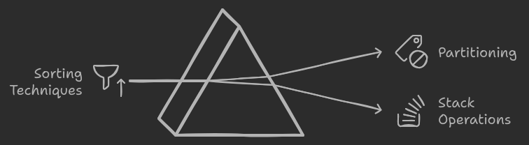
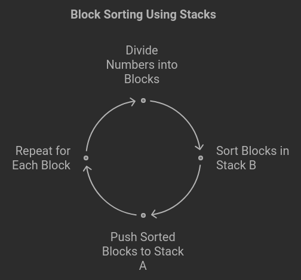
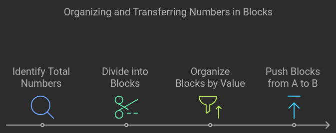
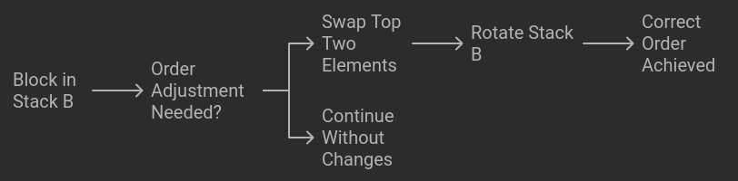
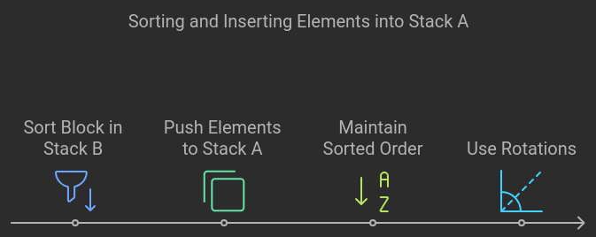

# Key Concept: Two Stack Sorting

### The basic idea remains to:

    Divide the numbers into blocks.
    Sort and move the blocks between the two stacks (a and b).
    Gradually build a sorted sequence in Stack A by carefully placing elements back from Stack B.

### Here’s how you can use your movements with Block Sort.

## Step 1: Divide into Blocks

    Split your numbers into chunks (blocks), based on the total size of the stack. For example, if you have 100 numbers, you can divide them into blocks of 20.
    These blocks should be organized by value (e.g., block 1 contains the smallest 20 numbers, block 2 the next 20, etc.).
    Push elements from A to B in chunks using pb.

### Example:

    Find the smallest 20 numbers in A (block 1).

    Use pb to push each number to Stack B until the first block is transferred.

    Useful commands here:
        pb to push from A to B.
        You can use ra or rra to rotate Stack A to find the correct element efficiently, rather than cycling through the whole stack.

## Step 2: Sorting Blocks in Stack B

Now that you've moved a block to Stack B, you need to sort it in B before pushing it back to Stack A.

    Once the block is in B, sort it using the available operations.
    Insertion Sort works well with this, as you can sort incrementally while elements are pushed into B:
        After each pb, check if you need to adjust the order in B using rb or rrb.
    Useful commands:
        sb to swap the top two elements if needed.
        rb and rrb to rotate Stack B to bring elements into the correct order.

## Step 3: Push Sorted Blocks Back to Stack A

Once a block is sorted in B, you push the elements back to Stack A.

    Use the pa operation to push elements back to A, ensuring you maintain sorted order in A.
    Use rotations (ra/rra) to insert elements at the correct position in Stack A.

### Example:

    After sorting block 1 in B, push it back to A using pa until Stack A has the smallest 20 numbers in order.

    Useful commands:
        pa to move from B to A.
        ra or rra to adjust the position in Stack A.

## Step 4: Repeat for Each Block

Continue this process for all the blocks:

    Push the next block to Stack B.
    Sort it.
    Push it back to Stack A in the correct order.

## Optimizations to Reduce Movements

### To minimize movements, you need to optimize how you rotate and push elements:

    Smart Rotations: When pushing blocks to Stack B, use ra/rra efficiently to avoid unnecessary operations. If the next element you want to push is closer to the top or bottom, use the corresponding rotate operation (ra or rra) to minimize movement.
    Merge Back Efficiently: When you are merging sorted blocks back into Stack A, make sure you are placing elements in the correct order by rotating A as needed, so you don’t need extra operations later.

## Why This Approach Works

    By dividing the array into manageable blocks, you can work within the constraints of limited operations, processing smaller chunks of data at a time.
    Sorting within Stack B helps you avoid having to perform unnecessary swaps in Stack A, and ensures that each block returns to A sorted, leading to an overall sorted array.
    You avoid the high number of swaps or unnecessary back-and-forth movements by sorting in smaller blocks.

## Additional Considerations

    Block Size: Experiment with different block sizes (e.g., √n for large inputs, or even smaller blocks for minimal swaps).
    Edge Cases: Handle small input sizes by directly sorting them using sa, sb, pa, and pb without block division if sorting a few elements.

## Example Plan

Suppose you have an array of 100 numbers:

1.   Divide the array into blocks of 20 numbers each.
2.   Push the first block of 20 smallest numbers to Stack B using pb, sorting it in B as you push elements.
3.    Push the sorted block back to Stack A using pa.
4.    Repeat this process for all remaining blocks until the array is sorted.

## Advantages of Block Sort:

    Block-Level Optimization: Sorting smaller blocks can be done quickly, and smaller arrays are often sorted faster by algorithms like insertion sort.

    Improved Cache Usage: Sorting in smaller blocks can improve cache locality, leading to better performance due to fewer cache misses.

    Scalability: This algorithm can scale well to large datasets, especially when combined with distribution techniques, making it suitable for massive datasets.

## Example
Example of Block Sort:

Suppose we have the following array to sort:
[9, 2, 8, 7, 3, 1, 6, 4, 5]

Divide into Blocks: Divide the array into 3 blocks:
Block 1: [9, 2, 8]
Block 2: [7, 3, 1]
Block 3: [6, 4, 5]

Sort Each Block: Sort each block individually:
Block 1 (sorted): [2, 8, 9]
Block 2 (sorted): [1, 3, 7]
Block 3 (sorted): [4, 5, 6]

Merge Blocks: Now merge the blocks as you would in merge sort:
Step 1: Merge Block 1 and Block 2: [1, 2, 3, 7, 8, 9]
Step 2: Merge with Block 3: [1, 2, 3, 4, 5, 6, 7, 8, 9]

Result: The final sorted array is:
[1, 2, 3, 4, 5, 6, 7, 8, 9]

This is a basic example of how Block Sort can be applied to sort an array of numbers. The key idea is to divide the array into blocks, sort each block, and then merge the sorted blocks to obtain the final sorted array.

## Block Sort in the Context of Push_Swap:

In push_swap, you can only use two stacks (A and B) and a set of specific operations (swap, push, rotate, reverse rotate). This constraint makes the direct implementation of Block Sort challenging. However, you can adapt the block sort concept as follows:

    Block Division:
        Divide the numbers into several blocks, say by value ranges. For instance, if you have numbers from 1 to 500, you could divide them into blocks like 1-100, 101-200, and so on.

    Move to Stack B:
        Push elements from Stack A to Stack B based on the block they belong to. You would push one block at a time. For example, if sorting the numbers in the 1-100 range, push all those numbers to Stack B first.

    Sort Blocks Individually in Stack B:
        Once a block is in Stack B, sort it using the available operations (pb, ra, rb, etc.). You can either use a simple sorting algorithm (for small blocks) or leverage an efficient sorting technique for larger blocks.

    Merge the Blocks Back:
        Once each block is sorted, push the numbers back from Stack B to Stack A, ensuring they are placed in the correct order.

Adapting Block Sort in Push_Swap:

In push_swap, a hybrid of Block Sort and Radix Sort often works best:

    Divide Stack A into blocks by ranges.
    Sort each block by pushing it to Stack B in smaller chunks.
    Merge blocks back to Stack A after sorting them.

Conclusion:

Block Sort is an efficient algorithm, especially for cases where sorting is done in stages or involves distribution. For the push_swap exercise, a hybrid approach that incorporates block-wise partitioning and sorting, while adhering to the operation constraints, could achieve a highly efficient solution with minimal moves.

---
---

Example of Partitioning and Sorting:

Let’s go through an example of how to partition into blocks, move elements between the stacks, and sort:

    Suppose you are sorting the following numbers in Stack A:

3 20 5 8 15 25 18 12 10 2

    Divide into blocks: You can partition the values into ranges (blocks). Let’s assume you divide them into two blocks:
        Block 1: Numbers 1–10
        Block 2: Numbers 11–25

    Move Block 1 (1–10) to Stack B:
        You can scan Stack A and push elements belonging to Block 1 to Stack B. Use ra to move elements around in Stack A and pb to push values in Block 1 to Stack B:

    Stack A:  20 15 25 18 12  ->  pb (moves all Block 1 elements to Stack B)
    Stack B:  3 5 8 2 10

Sort Block 1 in Stack B:

    You can use the sorting techniques you’ve implemented for small arrays (e.g., sorting 5 or fewer numbers). Stack B is now sorted:

    Stack A:  20 15 25 18 12
    Stack B:  2 3 5 8 10

Push Block 1 (sorted) back to Stack A:

    Now push Block 1 back to Stack A using pa (push A), ensuring the order is correct:

    Stack A:  2 3 5 8 10 20 15 25 18 12
    Stack B:  (empty)

Move Block 2 (11–25) to Stack B:

    Move elements in the range 11–25 (Block 2) to Stack B. Similarly, use pb to push them:

    Stack A:  (empty)
    Stack B:  20 15 25 18 12

Sort Block 2 in Stack B:

    Sort Block 2 while it’s in Stack B:

    Stack A:  2 3 5 8 10
    Stack B:  12 15 18 20 25

Push Block 2 (sorted) back to Stack A:

    Push the sorted values from Stack B back to Stack A:

            Stack A:  2 3 5 8 10 12 15 18 20 25
            Stack B:  (empty)

